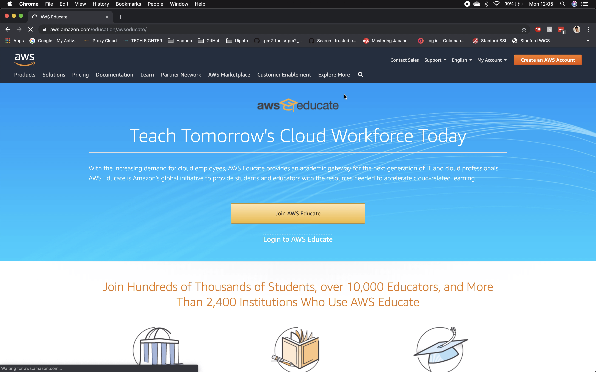
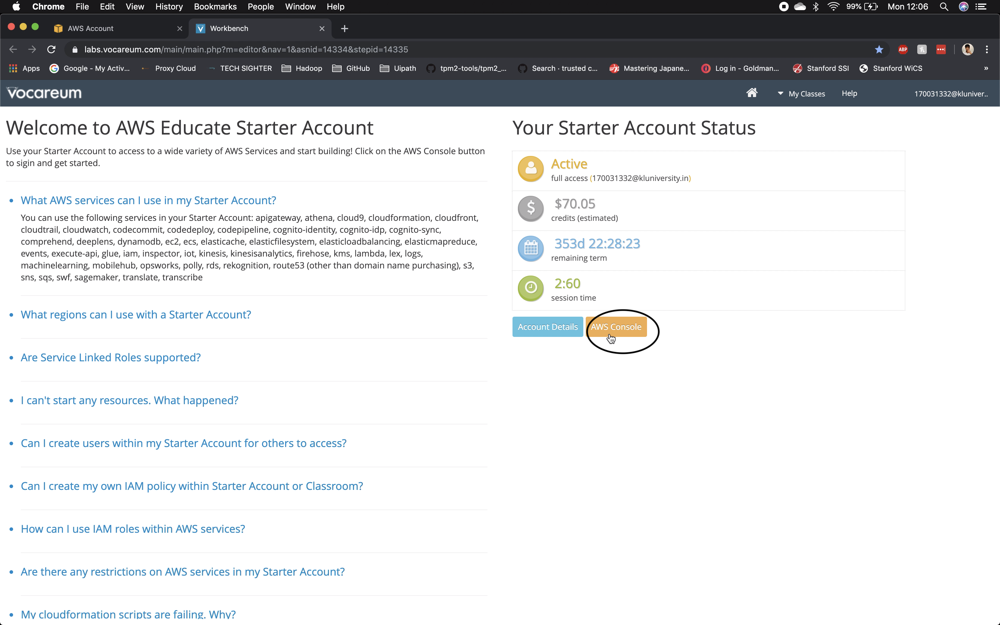

# Hadoop Single Node Cluster On EC2

### Creating a Single Node Hadoop Cluster on Amazon Web Services EC2

### Prerequisites
* AWS Acount
* Terminal [(If On Windows UNIX-Like terminal)](https://itsfoss.com/run-linux-commands-in-windows/)
* Stable Internet Connection

### Setting up of Instance in AWS EC2
1. Login to AWS (I've login using AWS Educate)

2.  Navigate to EC2

3. Launch an Instance

* Choose Ubuntu Server 18.04 LTS as Amazon Machine Image

* Choose t2.large as instance type (Recommended), if not you can go with other configuration

